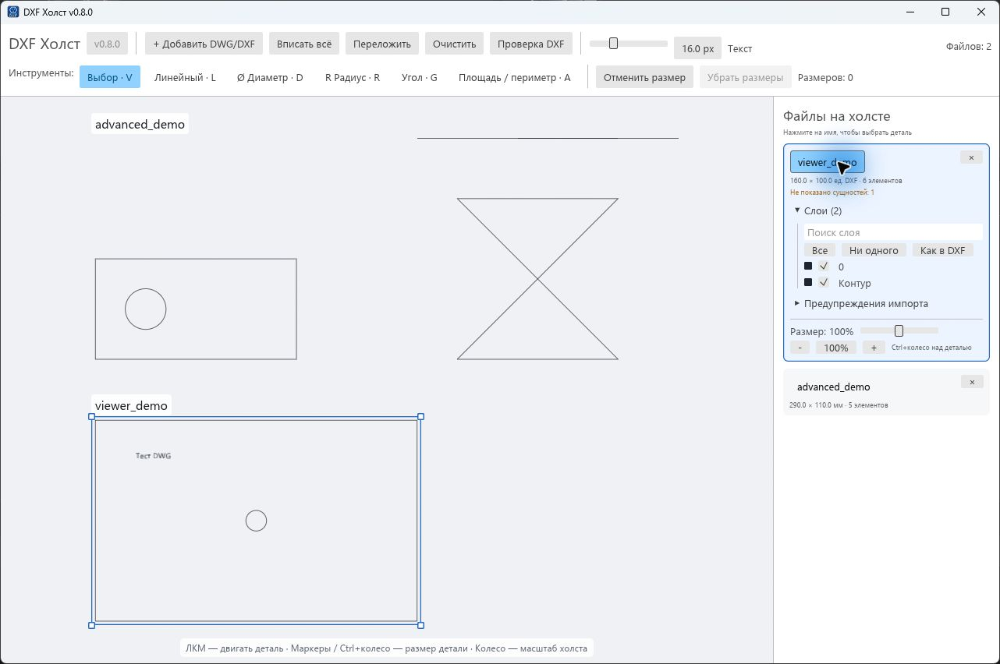
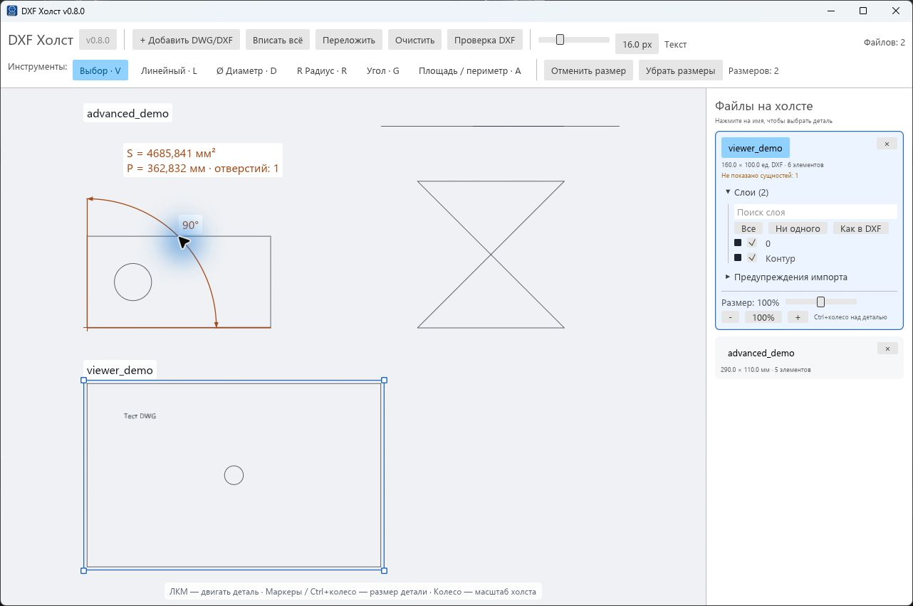
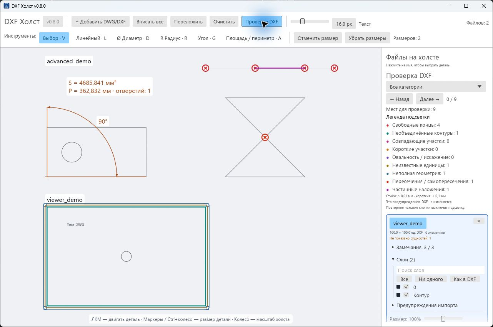

# DXF Холст — просмотрщик DXF и DWG

[](https://github.com/BrianIS8090/dxf-canvas/actions/workflows/windows.yml)
[](https://github.com/BrianIS8090/dxf-canvas/releases/latest)
[](LICENSE)


**Несколько DWG и DXF — один холст. Разложить, подписать, измерить и найти проблемные участки.**

Бесплатный просмотрщик двумерных CAD-чертежей **DXF и DWG для Windows** с открытым исходным кодом и русским интерфейсом. Открывайте детали и многослойные планы, управляйте слоями, измеряйте геометрию и находите проблемные участки. Несколько файлов можно разместить на одном холсте с подписями, независимо перемещать и увеличивать.

**DWG открывается прямо в приложении**: встроенный конвертер локально преобразует его во временный DXF. Ручная конвертация, установка CAD-системы, .NET или подключение к интернету не нужны. Исходные файлы не изменяются и не отправляются на сервер.

**[Скачать EXE для Windows →](https://github.com/BrianIS8090/dxf-canvas/releases/latest)** · [Управление](#управление) · [Измерения](#измерения) · [Проверка DXF](#проверка-dxf) · [Сборка](#сборка-из-исходников)



## Новое в 0.8.0

Этот выпуск объединяет все изменения после публичной версии 0.5.3:

- **Просмотр DXF и DWG** со слоями, цветами, текстами, размерами, блоками, заливками и штриховками.
- **Площадь, периметр и угол** — дополнение к линейным размерам, диаметрам и радиусам.
- **Девять категорий диагностики**, включая самопересечения и частичные наложения; фильтр и переходы «Назад / Далее».
- Ускоренный просмотр больших чертежей, фоновая загрузка с индикатором и очередью файлов.
- Исправления кириллицы в слоях и открытия DWG с виртуальных дисков.

[Описание выпуска 0.8.0](docs/releases/v0.8.0.md) · [Полная история изменений](CHANGELOG.md)

## Быстрый старт

1. Откройте [последний выпуск](https://github.com/BrianIS8090/dxf-canvas/releases/latest) и скачайте `DXF-Canvas-<версия>-windows-x64.exe` из раздела **Assets**.
2. Запустите файл. Установка приложения, Rust, .NET и CAD-системы не требуется. Сборка предназначена для Windows x64; проверяется на Windows 11.
3. Перетащите один или несколько `.dwg` / `.dxf` в окно либо нажмите **Добавить DWG/DXF**.
4. Используйте **Вписать всё**, инструменты измерений и кнопку **Проверка DXF**.

Для знакомства подойдут файлы из [examples](examples). Файл `.exe` не имеет цифровой подписи. Контрольная сумма каждого выпуска находится в `SHA256SUMS.txt`; способ проверки описан в [инструкции к релизам](docs/RELEASING.md).

## Возможности

- Несколько файлов на общем холсте с автоматической раскладкой.
- Подписи по именам файлов: один размер текста для всех деталей и общая настройка в шапке.
- Ручное перемещение и пропорциональное увеличение каждой детали.
- Линейные и угловые размеры, диаметры отверстий и радиусы скруглений с привязками к геометрии.
- Площадь материала без отверстий и суммарная длина внешних и внутренних границ.
- Девять категорий диагностических замечаний, цветная легенда, фильтр и переход к месту по щелчку или кнопками.
- Просмотр с увеличением и перемещением, быстрый возврат ко всей раскладке.
- Номер текущей версии в шапке и заголовке окна.
- Локальная работа с файлами: приложение не загружает чертежи на сервер.
- Слои DXF и преобразованных DWG: поиск, включение и выключение, возврат к исходной видимости.
- Цвета объектов и слоёв, тексты, размерные обозначения, выноски, сплошные заливки и штриховки.
- Ускоренный просмотр крупных чертежей и поиск привязок рядом с курсором; [методика замера](docs/PERFORMANCE.md).
- Фоновая загрузка DWG/DXF с анимированным индикатором, названием текущего этапа, именем файла и счётчиком очереди.
- Встроенная локальная конвертация DWG → DXF на ACadSharp (MIT), без сервера и установки дополнительных программ.

## Управление

| Действие | Как выполнить |
| --- | --- |
| Добавить файлы | **Добавить DWG/DXF**, `Ctrl+O` или перетаскивание из Проводника |
| Выбрать деталь | Щелчок по детали или её имени в правой панели |
| Переместить деталь | Потянуть выбранную деталь левой кнопкой |
| Изменить размер детали | Угловой маркер, `Ctrl` + колесо или настройка **Размер** справа |
| Изменить все подписи | Ползунок **Текст** в верхней панели, от 8 до 36 экранных единиц |
| Приблизить холст | Колесо мыши |
| Сдвинуть вид | Средняя кнопка; в режиме выбора также перетаскивание пустого места |
| Показать всё | **Вписать всё** или `Ctrl+0` |
| Разложить заново | **Переложить** |
| Убрать файл с холста | Крестик в его карточке; исходный файл не удаляется |

Визуальный масштаб детали меняет её размер на холсте, **но не исходные размеры DXF**. Подписи сохраняют единый экранный размер независимо от увеличения холста и отдельных деталей.

## Слои и сложные чертежи

Выберите файл в правой панели и раскройте **Слои**. Поиск фильтрует список по имени; флажок управляет видимостью слоя. **Все** включает слои, **Ни одного** выключает, **Как в DXF** восстанавливает исходные состояния, включая выключенные и замороженные слои. При одном открытом файле список доступен сразу.

Сохраняются цвета слоёв и индивидуальные цвета объектов, в том числе наследование внутри блоков. Фон остаётся светлым, белые линии преобразуются в тёмные. Скрытые слои не участвуют в привязках и диагностике. Штриховки, тексты, выноски и сохранённая графика размеров не считаются режущими контурами.

Настройка **Текст** меняет подписи с именами файлов и добавленные в приложении измерения. Текст внутри CAD-чертежа сохраняет свой размер в единицах DXF и увеличивается вместе с чертежом.

Оба формата проходят общий путь просмотра: слои, измерения и диагностика доступны и для DXF, и для DWG после внутреннего преобразования. На парном сложном эталоне проверены 168 слоёв и более 110 тысяч геометрических элементов. Подробные перечни сущностей и границы совместимости: [DXF](docs/DXF_SUPPORT.md) · [DWG](docs/DWG_SUPPORT.md). Предупреждения импорта доступны в карточке файла — сравнивайте ответственные чертежи с исходником в CAD.

## Измерения



| Инструмент | Последовательность |
| --- | --- |
| **Линейный** · `L` | Первая точка → вторая точка на той же детали → положение размерной линии |
| **Ø Диаметр** · `D` | Контур круглого отверстия → положение подписи |
| **R Радиус** · `R` | Круговая дуга или окружность → положение подписи |
| **Угол** · `G` | Первая точка → вершина → третья точка → размещение; меньший угол 0–180° |
| **Площадь / периметр** · `A` | Щелчок внутри замкнутой детали → размещение подписи S и P |

Привязки: **конец, середина, центр, квадрант, перпендикуляр и ближайшая точка контура**. Зона захвата — 10 экранных единиц. Для измерения расстояния между параллельными сторонами выберите первую точку и наведите курсор на вторую сторону до появления подписи **Перпендикуляр**.

`Esc` или правая кнопка отменяет постановку; `V` возвращает выбор. `Ctrl+Z` отменяет текущую постановку или последний размер. **Убрать размеры** очищает измерения в окне.

Размеры соответствуют исходной геометрии. При известных единицах DXF значения переводятся в миллиметры; иначе выводятся **ед. DXF**. Символ `≈` обозначает приближённое измерение. Некруговым отверстиям не присваивается выдуманный постоянный диаметр или радиус.

**S** — площадь материала с вычитанием отверстий и учётом вложенных островков; **P** — суммарная длина внешних и внутренних границ. Выбирается самый внешний замкнутый контур под курсором; отдельные детали одного файла не объединяются. Считаются только видимые режущие контуры, без текста/штриховки. Прямые и круговые дуги считаются аналитически, произвольные кривые — приближённо. При разрывах, пересечениях или неполной геометрии вместо сомнительного числа появляется предупреждение. Подробнее: [измерения и ограничения 0.8.0](docs/releases/v0.8.0.md).

## Проверка DXF



**Проверка DXF** включает подсветку и легенду. Повторное нажатие выключает их. Раскройте список замечаний в карточке файла и нажмите на строку: холст приблизит проблемный участок и дополнительно выделит его.

Фильтр над легендой управляет списком и подсветкой по категории. Кнопки **Назад / Далее** циклически переходят по видимым замечаниям всех файлов, приближая соответствующее место.

| Цвет | Категория | Что обнаруживается |
| --- | --- | --- |
| Красный | Свободные концы | Не найден стык в пределах 0,01 мм |
| Бирюзовый | Необъединённые контуры | Замкнутая цепочка из отдельных DXF-объектов; это не обязательно разрыв |
| Пурпурный | Совпадающие участки | Полные дубликаты участков с допуском 0,001 мм |
| Оранжевый | Короткие участки | Длина исходного участка меньше 0,1 мм |
| Фиолетовый | Овальность / искажение | Эллиптическая или искажённая округлая форма; она может быть намеренной |
| Охра | Неизвестные единицы | Нельзя достоверно перевести размеры в миллиметры |
| Синий | Неполная геометрия | Неподдерживаемые сущности или достижение ограничения проверки |
| Красно-оранжевый | Пересечения / самопересечения | Пересечение контуров, самопересечение или касание середины участка |
| Розово-фиолетовый | Частичные наложения | Общая часть прямых или круговых дуг; для произвольных кривых — приближённо |

Для файлов без единиц численные допуски применяются в единицах DXF. Проверка работает отдельно для каждого файла и не исправляет геометрию. Подробности — в [руководстве по диагностике](docs/DIAGNOSTICS.md).

## Ограничения

- Это просмотрщик и инструмент предварительной проверки, а не полноценный CAD-редактор и не гарантия готовности к лазерной резке.
- Раскладка предназначена для просмотра: это не оптимизация размещения для раскроя материала.
- Измерения и расположение деталей живут в текущем окне. Сохранение проекта и экспорт раскладки/размеров пока не реализованы.
- Размер между деталями из разных файлов не ставится: у файлов независимые системы координат.
- Произвольные кривые показываются приближённо. Не все виды сущностей DXF поддерживаются.
- Поддержка DWG не означает безошибочное чтение всех расширений CAD: внешние ссылки, 3D-тела, пользовательские объекты и листы с видовыми экранами не гарантируются. При предупреждениях результат требует проверки.
- Проверка пересечений ограничена защитными лимитами на сложных чертежах; в этом случае выводится предупреждение о неполноте. Сплайны проверяются приближённо. Пересечения на планах могут быть намеренными.

## Сборка из исходников

Нужны Rust stable, инструменты C++ MSVC из Visual Studio Build Tools, Windows SDK и .NET SDK **10.0.302** для сборки встроенного конвертера. Используется NativeAOT — предварительная компиляция в автономный EXE, поэтому пользователю .NET не нужен. Для Windows используйте цель `x86_64-pc-windows-msvc`. Другие платформы не проверялись.

```powershell
git clone https://github.com/BrianIS8090/dxf-canvas.git
cd dxf-canvas
./scripts/build-dwg-converter.ps1
cargo run --locked --release
```

Готовый файл: `target/release/dxf-canvas.exe`. Иконка окна и EXE формируется при сборке. Если Windows SDK установлен нестандартно, задайте переменную `RC` с путём к `rc.exe`.

Конвертер компилируется из `tools/dwg-converter` и встраивается в EXE при сборке Rust. Для отдельного SDK передайте `-Dotnet 'C:\путь\dotnet.exe'` в скрипт. Урезанная сборка только для DXF не требует .NET SDK: `cargo run --locked --release --no-default-features`. Ошибки DWG в такой сборке показываются явно.

```powershell
cargo fmt --check
cargo test --locked
cargo clippy --locked --all-targets -- -D warnings
cargo build --locked --release
```

В 0.8.0 локально прошли 126 публичных тестов и 4 отдельные проверки на частных файлах: DXF/DWG-эталон, кириллица в слоях и виртуальный диск. Публичные тесты используют синтетическую геометрию без производственных чертежей. Необязательные частные проверки описаны в [матрице DXF](docs/DXF_SUPPORT.md) и [руководстве DWG](docs/DWG_SUPPORT.md).

Демонстрации можно пересоздать командами `cargo run --example measurement_demo`, `cargo run --example diagnostics_demo` и `cargo run --example advanced_demo`. Синтетический DWG создаётся встроенным помощником: `./target/dwg-converter/DxfCanvas.DwgConverter.exe --write-test-dwg examples/viewer_demo.dwg` (выходной файл не должен существовать).

## Устройство проекта и участие

- `src/` — интерфейс, импорт DXF, геометрия, раскладка, измерения и диагностика.
- `tools/dwg-converter/` — исходники встроенного DWG → DXF конвертера на C# / ACadSharp.
- `examples/` — демонстрационные DXF, их генераторы и утилита анализа.
- `docs/` — скриншоты, диагностические ограничения и порядок выпуска.
- `.github/` — проверки, сборка релизов и шаблоны обращений.

Нашли ошибку? [Создайте issue](https://github.com/BrianIS8090/dxf-canvas/issues/new/choose), укажите версию и приложите минимальный неконфиденциальный пример.

[Правила участия](CONTRIBUTING.md) · [История изменений](CHANGELOG.md) · [Сообщить об уязвимости](SECURITY.md) · [Лицензия MIT](LICENSE)

[Сторонние компоненты](THIRD_PARTY_NOTICES.md) также перечислены в программе по нажатию на номер версии.

Все изображения выше — реальные скриншоты версии 0.8.0 с синтетическими демонстрационными, а не рабочими чертежами. Изображения прежнего интерфейса сохранены в истории репозитория.
