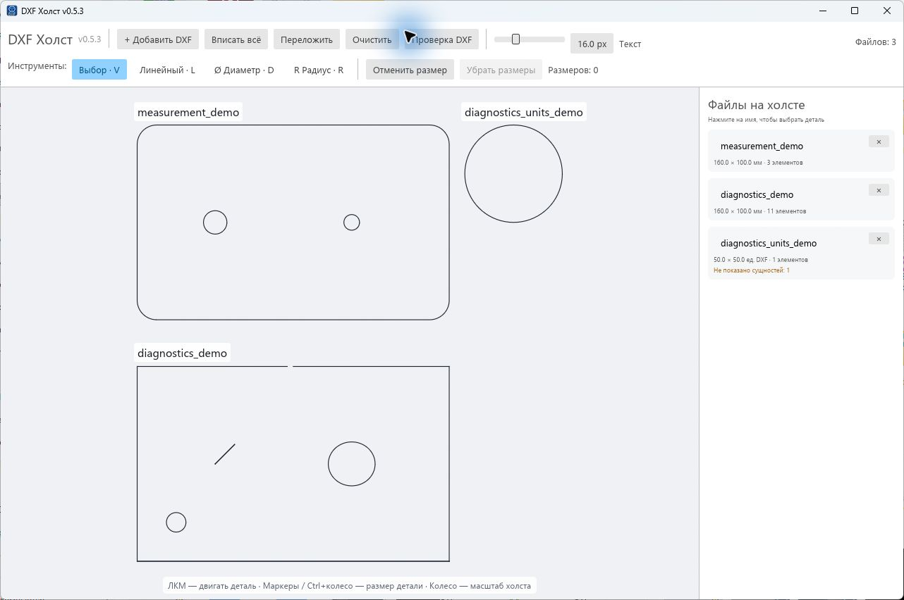
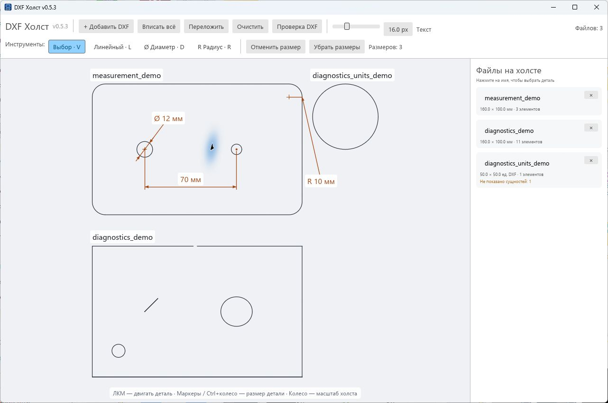
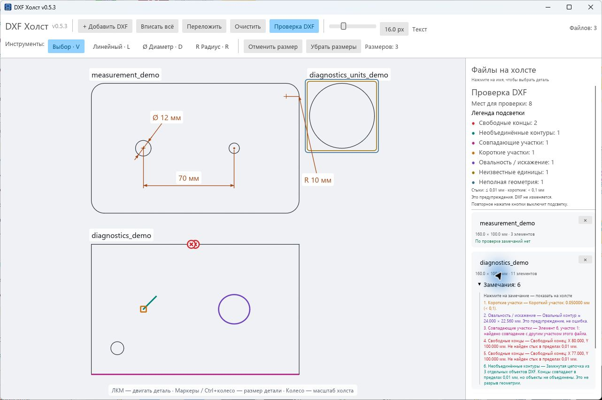

# DXF Холст

[](https://github.com/BrianIS8090/dxf-canvas/actions/workflows/windows.yml)
[](https://github.com/BrianIS8090/dxf-canvas/releases/latest)
[](LICENSE)


**Несколько DXF — один холст. Разложить, подписать, измерить и найти проблемные участки.**

Настольное приложение на Rust с русским интерфейсом. Перетащите чертежи в окно: программа расположит их рядом и подпишет именами файлов. Можно двигать и увеличивать каждую деталь, ставить размеры и включать проверку геометрии. Исходные DXF не изменяются.

**[Скачать EXE для Windows →](https://github.com/BrianIS8090/dxf-canvas/releases/latest)** · [Управление](#управление) · [Измерения](#измерения) · [Проверка DXF](#проверка-dxf) · [Сборка](#сборка-из-исходников)



## Быстрый старт

1. Откройте [последний выпуск](https://github.com/BrianIS8090/dxf-canvas/releases/latest) и скачайте `DXF-Canvas-<версия>-windows-x64.exe` из раздела **Assets**.
2. Запустите файл. Установка приложения и Rust не требуются. Сборка предназначена для Windows x64; проверяется на Windows 11.
3. Перетащите один или несколько `.dxf` в окно либо нажмите **Добавить DXF**.
4. Используйте **Вписать всё**, инструменты измерений и кнопку **Проверка DXF**.

Для знакомства подойдут файлы из [examples](examples). Файл `.exe` не имеет цифровой подписи. Контрольная сумма каждого выпуска находится в `SHA256SUMS.txt`; способ проверки описан в [инструкции к релизам](docs/RELEASING.md).

## Возможности

- Несколько файлов на общем холсте с автоматической раскладкой.
- Подписи по именам файлов: один размер текста для всех деталей и общая настройка в шапке.
- Ручное перемещение и пропорциональное увеличение каждой детали.
- Линейные размеры, диаметры отверстий и радиусы скруглений с привязками к геометрии.
- Семь категорий диагностических замечаний, цветная легенда и переход к месту по щелчку.
- Просмотр с увеличением и перемещением, быстрый возврат ко всей раскладке.
- Номер текущей версии в шапке и заголовке окна.
- Локальная работа с файлами: приложение не загружает чертежи на сервер.

## Управление

| Действие | Как выполнить |
| --- | --- |
| Добавить файлы | **Добавить DXF**, `Ctrl+O` или перетаскивание из Проводника |
| Выбрать деталь | Щелчок по детали или её имени в правой панели |
| Переместить деталь | Потянуть выбранную деталь левой кнопкой |
| Изменить размер детали | Угловой маркер, `Ctrl` + колесо или настройка **Размер** справа |
| Изменить все подписи | Ползунок **Текст** в верхней панели, от 8 до 36 экранных единиц |
| Приблизить холст | Колесо мыши |
| Сдвинуть вид | Средняя кнопка; в режиме выбора также перетаскивание пустого места |
| Показать всё | **Вписать всё** или `Ctrl+0` |
| Разложить заново | **Переложить** |
| Убрать файл с холста | Крестик в его карточке; исходный файл не удаляется |

Визуальный масштаб детали меняет её размер на холсте, **но не исходные размеры DXF**. Подписи сохраняют единый экранный размер независимо от увеличения холста и отдельных деталей.

## Измерения



| Инструмент | Последовательность |
| --- | --- |
| **Линейный** · `L` | Первая точка → вторая точка на той же детали → положение размерной линии |
| **Ø Диаметр** · `D` | Контур круглого отверстия → положение подписи |
| **R Радиус** · `R` | Круговая дуга или окружность → положение подписи |

Привязки: **конец, середина, центр, квадрант, перпендикуляр и ближайшая точка контура**. Зона захвата — 10 экранных единиц. Для измерения расстояния между параллельными сторонами выберите первую точку и наведите курсор на вторую сторону до появления подписи **Перпендикуляр**.

`Esc` или правая кнопка отменяет постановку; `V` возвращает выбор. `Ctrl+Z` отменяет текущую постановку или последний размер. **Убрать размеры** очищает измерения в окне.

Размеры соответствуют исходной геометрии. При известных единицах DXF значения переводятся в миллиметры; иначе выводятся **ед. DXF**. Символ `≈` обозначает приближённое измерение. Некруговым отверстиям не присваивается выдуманный постоянный диаметр или радиус.

## Проверка DXF



**Проверка DXF** включает подсветку и легенду. Повторное нажатие выключает их. Раскройте список замечаний в карточке файла и нажмите на строку: холст приблизит проблемный участок и дополнительно выделит его.

| Цвет | Категория | Что обнаруживается |
| --- | --- | --- |
| Красный | Свободные концы | Не найден стык в пределах 0,01 мм |
| Бирюзовый | Необъединённые контуры | Замкнутая цепочка из отдельных DXF-объектов; это не обязательно разрыв |
| Пурпурный | Совпадающие участки | Полные дубликаты участков с допуском 0,001 мм |
| Оранжевый | Короткие участки | Длина исходного участка меньше 0,1 мм |
| Фиолетовый | Овальность / искажение | Эллиптическая или искажённая округлая форма; она может быть намеренной |
| Охра | Неизвестные единицы | Нельзя достоверно перевести размеры в миллиметры |
| Синий | Неполная геометрия | В файле есть неподдерживаемые сущности |

Для файлов без единиц численные допуски применяются в единицах DXF. Проверка работает отдельно для каждого файла и не исправляет геометрию. Подробности — в [руководстве по диагностике](docs/DIAGNOSTICS.md).

## Ограничения

- Это просмотрщик и инструмент предварительной проверки, а не полноценный CAD-редактор и не гарантия готовности к лазерной резке.
- Раскладка предназначена для просмотра: это не оптимизация размещения для раскроя материала.
- Измерения и расположение деталей живут в текущем окне. Сохранение проекта и экспорт раскладки/размеров пока не реализованы.
- Размер между деталями из разных файлов не ставится: у файлов независимые системы координат.
- Произвольные кривые показываются приближённо. Не все виды сущностей DXF поддерживаются.
- Самопересечения, частичные наложения и касания конца к середине участка не проверяются.

## Сборка из исходников

Нужны Rust stable, инструменты C++ MSVC из Visual Studio Build Tools и Windows SDK. Локальная версия 0.5.3 проверена на Rust 1.97.1. Для Windows используйте цель `x86_64-pc-windows-msvc`. Другие платформы не проверялись.

```powershell
git clone https://github.com/BrianIS8090/dxf-canvas.git
cd dxf-canvas
cargo run --locked --release
```

Готовый файл: `target/release/dxf-canvas.exe`. Иконка окна и EXE формируется при сборке. Если Windows SDK установлен нестандартно, задайте переменную `RC` с путём к `rc.exe`.

```powershell
cargo fmt --check
cargo test --locked
cargo clippy --locked --all-targets -- -D warnings
cargo build --locked --release
```

В комплекте 72 автоматических теста. Публичный набор использует синтетическую геометрию без производственных чертежей. Демонстрации можно пересоздать командами `cargo run --example measurement_demo` и `cargo run --example diagnostics_demo`.

## Устройство проекта и участие

- `src/` — интерфейс, импорт DXF, геометрия, раскладка, измерения и диагностика.
- `examples/` — демонстрационные DXF, их генераторы и утилита анализа.
- `docs/` — скриншоты, диагностические ограничения и порядок выпуска.
- `.github/` — проверки, сборка релизов и шаблоны обращений.

Нашли ошибку? [Создайте issue](https://github.com/BrianIS8090/dxf-canvas/issues/new/choose), укажите версию и приложите минимальный неконфиденциальный пример.

[Правила участия](CONTRIBUTING.md) · [История изменений](CHANGELOG.md) · [Сообщить об уязвимости](SECURITY.md) · [Лицензия MIT](LICENSE)

Все изображения выше — реальные скриншоты версии 0.5.3 с демонстрационными, а не рабочими чертежами.
